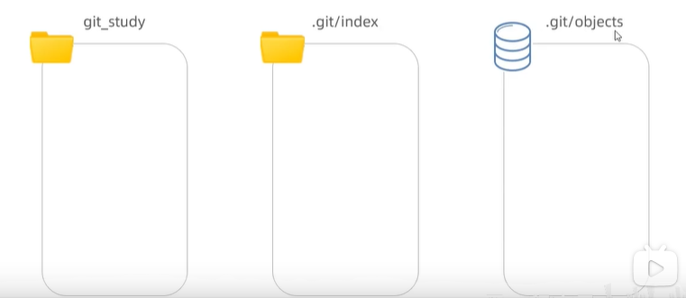

# Git

## 1. Git初识

- 概念：一个免费开源，分布式的代码版本控制系统，帮助开发团队维护代码
- 作用：记录代码内容，切换代码版本，多人开发时高效合并代码内容
- 个人本机使用：Git基础命令和概念
- 多人共享使用：团队开发同一个项目的代码版本管理

- 安装成功
  - 打开bash终端（git专用）

```bash
# 查看版本命令
git -v
```

- Git配置用户信息
  - 配置：用户名和邮箱，应用在每次提交代码版本时表明自己身份

```bash
# 设置用户名和邮箱
git config --global user.name "username"
git config --global user.email "userEmail"
```

```bash
# 查看属性（如果没有出现，则按↓继续查找，直到出现END）
git config --list
```

## 2. 仓库

- Git仓库（repository）：记录文件状态内容的地方，存储着修改的历史记录
- 创建
  - 把本地文件夹转换成Git仓库

```bash
# 初始化仓库
git init
```

- 从其他服务器上克隆Git仓库

```bash
git clone "url"
```

## 3. Git的三个区域

- Git使用时：
  - 工作区：实际开发时操作的文件夹
  - 暂存区：保存之前的准备区域（暂存改动过的文件）
  - 版本库：提交并保存暂存区中的内容，产生一个版本快照（返回一个6字节的hash值）



```bash
# 暂存指定文件
git add 文件名

# 暂存所有改动的文件
git add .

# 提交并保存，产生版本快照
git commit -m "注释说明"
```

```bash
# 查看当前暂存区的文件
git ls-files
```

## 4. 文件状态

- Git文件2种状态
  - 未跟踪：新文件，从未被Git管理过
  - 已跟踪：Git已经知道和管理的文件

|文件状态|概念|场景|
|---|---|---|
|未跟踪（U）|从未被Git管理过|新文件|
|新添加（A）|第一次被Git暂存|之前版本记录无此文件|
|未修改（''）|三个区域统一|提交保存后|
|已修改（M）|工作区内容变化|修改了内容产生|

- 使用：修改文件，暂存，提交保存记录，如此反复操作
- 需求：新增css文件，并使用 git status -s 查看文件状态，并最终提交

```bash
# 查看文件状态
git status -s
```

## 5. 暂存区使用

- 暂存区：暂时存储，可以临时恢复代码内容，与版本库解耦
- 暂存区→覆盖→工作区，命令：git restore 目标文件（注意：完全确认覆盖时使用）

```bash
# 把暂存区的文件覆盖回工作区
git restore 目标文件

# 从暂存区移除文件
git rm --cached 目标文件
```

```bash
# 查看提交的记录
git log --oneline
```

## 6. 回退版本

- 概念：把版本库某个版本对应的内容快照，恢复到工作区/暂存区
- 回退命令：
  - soft：其他文件未跟踪
  - hard：彻底清理
  - mixed：与reset等价，覆盖暂存区，保留工作区
- 注意：只有记录在版本库的提交记录才能恢复
  - 一般先和暂存区对比，再对比工作区

```bash
# 恢复到之前版本
git reset --soft/hard/mixed 版本号
```

```bash
# 查看完整提交记录
git reflog --oneline
```

## 7. 删除文件

- 需求：删除文件，并产生一次版本记录
- 步骤：
  - 手动删除工作区文件
  - 暂存变更/手动删除暂存区文件造成变更
  - 提交保存
- 总结：工作区只要改变，都可以暂存提交产生新纪录

## 8. 忽略文件

- 概念：.gitignore文件可以让git彻底忽略跟踪指定文件
- 目的：让git仓库更小更快，避免重复无意义的文件管理，例如
  - 系统或软件自动生成的文件
  - 编译产生的结果文件
  - 运行时生辰的日志文件，缓存文件，临时文件等
  - 涉密文件，密码，密匙等文件
- 创建：
  - 项目根目录新建.gitignore文件
  - 填入相应配置来忽略指定文件
- 注意：如果文件已经被暂存区跟踪过，可以从暂存区移除即可

## 9. 分支

- 概念：本质上是指向提交节点的可变指针，默认名字是 master
- 注意：HEAD指针影响工作区/暂存区的代码状态
  - 可能会有多个提交指针（master/main/content），就需要HEAD指向


- 场景：开发新需求/修复Bug，保证主线代码随时可用，多人协同开发提高效率，例如：
  - 在现有代码上创建新分支完成内容列表任务
  - 突然需要紧急修复Bug-单独创建分支解决Bug


- 步骤
  - 创建分支命令，以当前HEAD指针的指向作为起点
  - 切换分支命令
  - 工作 准备代码并暂存提交，重复3次

```bash
# 创建新分支
git branch 分支名
# 切换分支命令
git checkout 分支名
# 创建同时切换
git checkout -b 分支名
```

```bash
# 查看当前工作目录中有哪些分支
git branch
```

## 10. 分支的合并与删除

- 需求：把login-bug合并回到master分支并删除login-bug分支
- 步骤：
  - 切回到要合入的分支上：git checkout master
  - 合并其他分支过来，同时把主分支指向到最后提交的分支上
  - 删除合并后的分支指针

```bash
# 合并其他分支
git merge 分支名（login-bug）
# 删除合并后的分支指针
git branch -d 分支名（login-bug）
```

## 11. 分支的合并与提交

- 合并提交：发生于原分支产生了新的提交记录后，再合并回去时发生，自动使用多个快照记录合并后产生一次新的提交
- 步骤
  - 切回到要合入的分支上
  - 合并其他分支过来
  - 删除合并后的分支
- 注意：提交记录的顺序按照产生的先后顺序排列，而非合并的先后顺序

## 12. 分支的合并冲突

- 需求
  - 基于master新建publish分支，完成发布文章业务，然后修改内容页面的html文件的title标题，并提交一次
  - 切换到master，也在修改内容页面的html文件的title标签，并提交一次
- 冲突：把publish分支合并到master回来，产生合并冲突
- 概念：不同分支中，对同一个文件的同意部分修改，git无法干净的合并，产生合并冲突
- 解决
  - 打开vs找到冲突文件并手动解决
  - 解决后需要提交一次记录
- 避免（多交流）
  - 按页面划分不同分支开发
  - 公共代码在同一文件夹维护
  - Node等软件版本统一，npm包同意下载

## 13. 远程仓库

[参见：Git远程仓库](https://www.bilibili.com/video/BV1MN411y7pw?p=134)

- 概念：托管在因特网或者其他网络中的项目版本库
- 作用：保存版本库的历史记录，多人协作
- 创建：公司自己服务器/第三方托管平台（Gitee/GitLab/GitHub）
- 步骤：
  - 注册第三方托管平台网站账户
  - 新建仓库得到远程仓库Git地址
  - 本地Git仓库添加远程仓库原点地址
  - 本地Git仓库推送版本记录到远程仓库

```bash
# 本地仓库添加远程仓库
git remote add 远程仓库别名（自定义） 远程仓库地址

# 远程仓库信息
git remote -v

# 本地仓库版本推送到远程仓库
git push -u 远程仓库别名 本地:远程分支名(自定义)
```

```bash
# 移除远程仓库
git remote remove 远程仓库别名
```

## 14. 远程仓库的克隆

- 克隆：拷贝一个Git仓库到本地，进行使用

```bash
# 克隆远程仓库
git clone 远程仓库地址
```

- 效果：在运行命令所在文件夹，生成work项目文件夹（包括版本库，并映射到暂存区和工作区）
- 注意：
  - Git本地仓库已经建立好和远程仓库的链接
  - 仓库公开随意克隆，推送需要身为仓库团队成员

## 15. 多人协同开发

[参见：多人协作](https://www.bilibili.com/video/BV1MN411y7pw?p=136&spm_id_from=pageDriver&vd_source=f40647174bbe18dd653480aa72a3935d)

- 本地开发代码→工作区→暂存区→提交→拉取（可选）→推送

```bash
# 拉取合并
git pull origin master
# 等价于
git fetch origin master:master（获取远程分支记录到本地，未合并）
git merge origin/master（把远程分支记录合并到所在分支下）

# 提交推送
git push
```

## 16. VS中使用Git

- 点击"+"暂存
- 提交并写明修改信息
- 同步到远程分支（自动先拉取再合并）
  - 建议修改前先拉取
  - 如果存在冲突会提醒并自行做出修改

>master org edit
